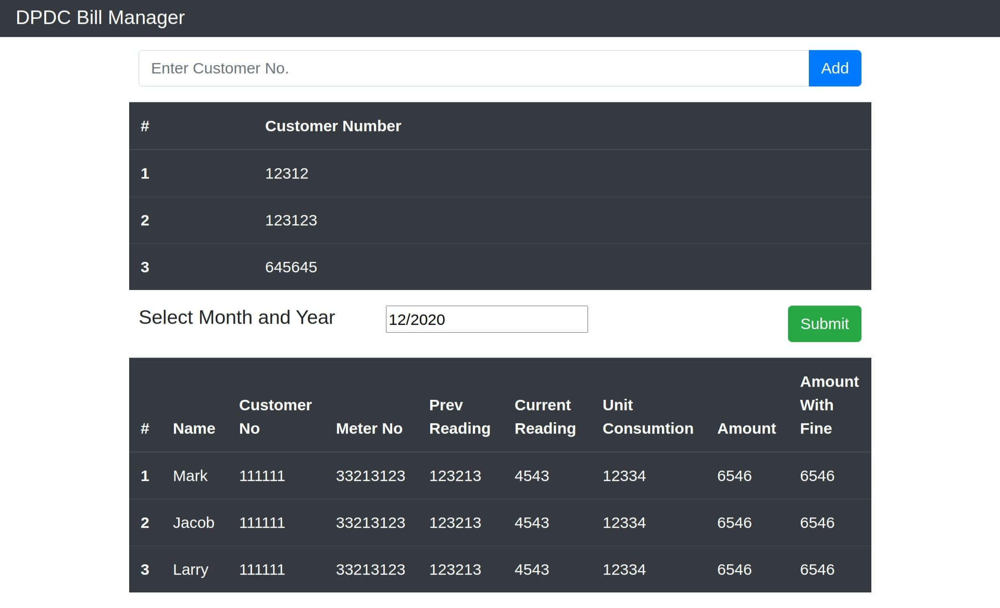

# ⚡️ DPDC Bill Manager⚡️

## Description

An app to manage multiple electricity bill for Dhaka Power Distribution Company.

## Example

<p align="center">
  <kbd>
</img>
  </kbd>
</p>

## Heroku

https://dpdc-bill-manager.herokuapp.com/

## Motivation

My apartment has 5 electric meter and for each meter a bill is produce by my local power distributor([DPDC](https://dpdc.org.bd/)).Each month i have to download 5 bill copies from DPDC site.Even though DPDC provide me a hard copy for each bill i have to manually calculate the total bill amount.Because i am super lazy and have some medicore programming knowledge i build this app to make this process automated.

## Installation

First clone this repository.

```bash
git clone https://github.com/mirsahib/DPDC-Bulk-Bill-Viewer.git
```

Install dependencies. Make sure you already have [`nodejs`](https://nodejs.org/en/) & [`npm`](https://www.npmjs.com/) installed in your system.

```bash
yarn
cd client
yarn
```

After successfull installation run

```bash
yarn dev
```

## How to reuse this project according to your need

You need to know [cheerio](https://cheerio.js.org/) before you can start editing the scrapper function

Goto `controllers/scraper.controller.js` and edit the file according to your need

## API

Base url : http://localhost:5000/

| URL        | Parameter                                        | Response                                                                                                                                                                | Description                           |
| ---------- | ------------------------------------------------ | ----------------------------------------------------------------------------------------------------------------------------------------------------------------------- | ------------------------------------- |
| `/scraper` | <ul><li>cno</li><li>year</li><li>month</li></ul> | <ul><li>Name</li><li>Customer No</li><li>Meter No</li><li>Previous unit</li><li>Current Unit</li><li>Unit Consumption</li><li>Amount</li><li>Amount with fine</li></ul> | **cno** is a list of customer number, |

Example: http://localhost:5000/scraper?cno=customer_no_1,customer_no_2&year=2020&month=10

NB: Use [Postman](https://www.postman.com/) to test the api

## Serverless API

Comming soon

## Future Development

I want to scrape

- [DSCC](http://www.dscc.gov.bd/) (Corporation tax)
- [Titas](https://www.titasgas.org.bd/) (Gas distributor)
- [Wasa](http://dwasa.org.bd/) (Water And Sewage Authtority )
- [NBR](http://nbr.gov.bd/) (Income tax)

to make a complete Unitily manager for Dhaka's citizen.

## Challenges for future development

- DSCC - has a customer portal which has a login system,at the moment of writing this document i don't know how to perform form submission using cheerio (this might not be possible with cheerio,have to use puppeteer or other scraping framework)
- Titas - has a customer portal but i need a customer code to register to there portal which will be provided upon making a call to there helpline 16496,at the moment of writting this document nobody is picking up my call.Way to go digital Bangladesh
- WASA - has a customer portal,need more research
- NBR - need more research

## Contribution

If you want to **contribute** and make this project much better for other developer have a look at [Issues](https://github.com/mirsahib/DPDC-Bulk-Bill-Viewer/issues).

If you created something awesome and want to contribute then feel free to open a [pull request](https://github.com/mirsahib/DPDC-Bulk-Bill-Viewer/pulls).

## Bug

In the future the app may crash because of

`UnhandledPromiseRejectionWarning: Error [ERR_HTTP_HEADERS_SENT]: Cannot set headers after they are sent to the client`.

Its a nodejs warning which means promise rejection is not handled in the try-catch block and in the future Nodejs will not show this warning,instead they will crash the app.This warning is generated in `/controller/scrapper.controller.js` and its happening because maybe inside the axios catch block there is an error which is not handled.Javascript try-catch work in very misterious way it only handle error on current code block,it won't handle error if current code is nested so we have to handle the nested code on another code block.If you want to know more about javascript error handling then do read

- https://alphacoder.xyz/nodejs-unhandled-promise-rejection-warning/
- https://medium.com/dailyjs/how-to-prevent-your-node-js-process-from-crashing-5d40247b8ab2

I am currently really tired to solve this issue,If you can solve it please make a PR.

## Special Thanks

This app is based on [Esau Silva's](https://esausilva.com/) [example-create-react-app-express](https://github.com/esausilva/example-create-react-app-express)

## Tutorial

Visit [Esau Silva's](https://esausilva.com/2017/11/14/how-to-use-create-react-app-with-a-node-express-backend-api/) blog to get step-by-step guide of how to make a node-express-react app in same directory
